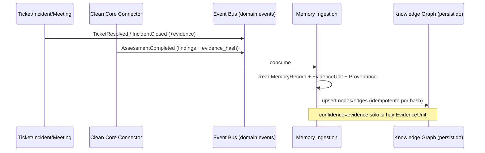

# ROCCO — Organizational Memory & Enterprise Knowledge Graph (Domain Design v1.0)

> **Diseño de dominio (DDD). NO es implementación.** Cumple el Artículo 14: se diseña antes de
> codificar. Los contratos en TypeScript/SQL son **ilustrativos** ("contratos propuestos"), no
> código a mergear. Ancla en lo que **ya existe** (`agent/backend/src/services/graph.service.ts`)
> y lo **extiende**, no lo reemplaza.
>
> Este es el diseño del **activo #1** de ROCCO (Constitución, Art. 8-9).

---

## 1. Por qué este es el corazón (no un módulo más)

Bajo el Gate de Gobierno (Art. 13), la Memoria Organizacional es lo único que puntúa **sí** en
las 10 preguntas simultáneamente: preserva conocimiento, incrementa productividad (recuperación
instantánea), reduce riesgo (no se pierde el "por qué"), fortalece SAP (relaciona objetos con
incidentes/decisiones), y es el sustrato para que la IA sea explicable (Art. 11: cada
afirmación de IA se ancla a nodos de evidencia). Todo lo demás **alimenta** este núcleo.

**Principio rector:** *nada que genere conocimiento operacional queda fuera de la memoria.*

## 2. Lenguaje Ubicuo (Ubiquitous Language)

- **Memory Record** — unidad atómica de memoria: un hecho preservado (un incidente resuelto,
  una decisión de arquitectura, un assessment, un cambio de config). Inmutable + versionable.
- **Evidence Unit** — el respaldo verificable de un Memory Record (un hallazgo del connector
  con `evidence_hash`, un adjunto, un transporte, un log). Fiel al Art. 4: sin Evidence Unit,
  un Record es **hipótesis**, no memoria.
- **Provenance** — quién/qué/cuándo/desde qué fuente originó un Record (actor, sistema, IA vs
  humano, hash de input). Obligatoria.
- **Knowledge Node / Edge** — nodo/arista del grafo (la proyección relacional del conocimiento).
- **Decision** — un Record de tipo especial: una elección con contexto, alternativas y racional
  (el "por qué" que hoy se pierde). Primera clase.
- **Retrieval** — recuperación híbrida (graph traversal + RAG semántico) que responde "¿qué
  sabemos sobre X?".

## 3. Bounded Contexts

```mermaid
flowchart LR
  subgraph Core[Core Domain]
    OM[Organizational Memory]
    KG[Knowledge Graph]
  end
  subgraph Supporting[Supporting Domains]
    SAPK[SAP Knowledge<br/>(objetos/tablas/notes/clean-core)]
    OPS[AMS Operations<br/>(tickets/incidents/meetings)]
    KB[Knowledge Base / RAG]
    GOV[Governance & Audit]
  end
  subgraph Generic[Generic]
    IAM[Identity & Tenancy]
    AIP[AI Providers<br/>(reemplazables)]
  end
  OPS -->|domain events| OM
  SAPK -->|domain events| OM
  KB -->|domain events| OM
  OM --> KG
  OM --> GOV
  KG -->|Retrieval| AIP
  AIP -->|propone, no decide| OPS
```

**Core:** Organizational Memory + Knowledge Graph (lo que ROCCO *es*).
**Supporting:** SAP Knowledge (incluye el connector Clean Core como **proveedor de nodos
SAP-técnicos**), AMS Operations, Knowledge Base/RAG, Governance & Audit.
**Generic:** Identity/Tenancy y AI Providers (reemplazables, Art. 11).

## 4. Modelo de dominio (agregados)

### 4.1 `MemoryRecord` (aggregate root)
Ilustrativo:
```ts
// CONTRATO PROPUESTO — no implementado
interface MemoryRecord {
  id: string;                 // uuid
  tenantId: string;           // aislamiento duro (Art. 12)
  kind: MemoryKind;           // incident_resolution | decision | assessment | config_change | learning | doc
  title: string;
  body: string;               // narrativa canónica
  provenance: Provenance;     // OBLIGATORIA
  evidence: EvidenceRef[];    // >=1 para pasar el quality gate de memoria (Art.4)
  nodes: NodeRef[];           // a qué entidades del grafo refiere
  confidence: "evidence" | "inferred" | "unverified";  // nunca ocultar incertidumbre
  version: number;
  supersedes?: string;        // versionado inmutable (append-only)
  createdAt: string; createdBy: string;
}
type MemoryKind = "incident_resolution"|"decision"|"assessment"|"config_change"|"learning"|"doc";
```

### 4.2 `EvidenceUnit` + `Provenance` (Evidence by Design, Art. 4)
```ts
interface EvidenceUnit {
  id: string; tenantId: string;
  source: "sap_connector"|"sap_readonly"|"ticket"|"meeting"|"document"|"human"|"ai";
  ref: string;                // p.ej. findingId, transportId, url
  hash?: string;              // reproducibilidad (patrón ya probado en el connector)
  capturedAt: string; capturedBy: string;
}
interface Provenance {
  origin: "human"|"ai"|"system";
  actor: string;              // usuario o modelo
  aiModel?: string;           // si origin=ai (trazabilidad del proveedor reemplazable)
  inputHash?: string;         // qué input produjo esto
  at: string;
}
```
**Regla dura:** un `MemoryRecord` con `confidence: "evidence"` **debe** tener `evidence.length ≥ 1`.
La IA puede crear Records, pero nacen `confidence: "inferred"` hasta que un humano los ratifica
(Art. 11: la IA propone, el consultor decide).

### 4.3 `Decision` (recuperar el "por qué")
Sub-tipo de `MemoryRecord` con `context`, `alternatives[]`, `chosen`, `rationale`,
`reversible: boolean`. Hoy el racional de las decisiones AMS/arquitectura **se pierde**; este
agregado lo convierte en memoria consultable.

## 5. La ontología del Knowledge Graph (A9)

Hoy: 5 nodos (incident/ticket/conversation/kb/meeting) proyectados en lectura. **Diseño
objetivo:** grafo **persistido** con tres familias de nodo. El connector Clean Core alimenta la
familia SAP-técnica.

### Taxonomía de nodos
| Familia | Tipos de nodo | Fuente (proveedor) |
|---|---|---|
| **Operacional** | incident · ticket · conversation · meeting · kb_article · customer_response | AMS Operations (ya existe) |
| **SAP-técnica** | sap_object · transaction · table · interface · transport · sap_note · role · config_item · cds_view · api_released | SAP Knowledge / **connector Clean Core** (findings → nodos) |
| **Gobierno/Negocio** | decision · process · system · assessment · risk · user · organization | Memory / Governance |

### Taxonomía de aristas (edges tipados, dirigidos, con provenance)
`escalated` · `uses_kb` · `kb_from` (ya existen) + propuestos: `affects` (ticket→sap_object),
`writes_to` / `reads_from` (sap_object→table), `calls` (sap_object→transaction|api),
`transported_by` (sap_object→transport), `remediated_by` (finding→decision),
`references_note` (→sap_note), `owned_by` (→role|user), `decided_by` (decision→user),
`supersedes` (versión), `derived_from` (memory→evidence).

Cada edge lleva `{tenantId, kind, from, to, provenance, weight?, since?}` — **nunca** una
relación sin origen trazable (Art. 4).

### Contrato de consulta (extiende el actual `GraphPayload`)
```ts
// Extiende agent/backend/src/services/graph.service.ts (compat hacia atrás)
interface GraphQuery {
  tenantId: string;
  seedNodeId?: string;        // "¿qué sabemos alrededor de este objeto SAP?"
  nodeTypes?: NodeType[];     // filtro
  depth?: 1|2|3;              // traversal acotado
  since?: string;
}
```

## 6. Ingesta: "todo alimenta la memoria" (event-driven)

Cada subsistema emite **domain events**; un **Memory Ingestion** los transforma en Records +
Nodes + Edges. Nada escribe el grafo directamente: se hace por eventos (desacople, auditable).



Eventos iniciales (mapeo a lo existente): `TicketResolved`, `IncidentClosed`,
`KbArticleApproved`, `MeetingSummarized`, `AssessmentCompleted` (del connector),
`DecisionRecorded`, `ConfigChangeObserved`.

## 7. Retrieval híbrido (graph + RAG) y gobierno de IA

Pregunta del usuario → **(a)** traversal en el grafo desde nodos-semilla (relaciones exactas) +
**(b)** RAG semántico sobre los Records (ya hay embeddings: `training-embeddings.service.ts`,
`knowledge.service.ts`). La IA **compone** una respuesta **citando Records/Evidence Units** (no
inventa; Art. 4). Si no hay evidencia, responde explícitamente "no hay memoria sobre esto".
Todo output IA queda con `Provenance{origin: ai, aiModel}` → explicable y auditable (Art. 11).

## 8. Multi-tenant, seguridad, auditoría

- **Tenant isolation** en cada nodo/edge/record (`tenant_id`), reutilizando el patrón existente
  (`middleware/tenant.ts`, `scopedWhere`).
- **RBAC**: leer/escribir memoria respeta `usePermissions`/`requirePermission`.
- **Audit**: toda mutación de memoria emite un evento de auditoría (reusar `audit_events`).
- **Propiedad/portabilidad** (Art. 12): endpoint de export de toda la memoria del tenant.

## 9. Mapeo de lo existente → el modelo (no se tira nada)

| Hoy | Rol en el modelo |
|---|---|
| `graph.service.ts` (5 nodos, lectura) | Semilla del Knowledge Graph; se persiste y amplía |
| `kb_articles`, `incidents`, `support_tickets`, `meetings` | Nodos operacionales + fuente de Records |
| `ticket_intelligence_history` | Versionado/provenance de Records de tickets |
| `audit_events` | Backbone de auditoría de la memoria |
| Connector Clean Core (findings + `evidence_hash`) | Proveedor de nodos SAP-técnicos + Evidence Units |
| Embeddings/RAG | Índice del Retrieval híbrido |
| IA conmutable (Gemini/Anthropic) | Componedor de respuestas, reemplazable |

## 10. Roadmap por fases (con el Gate aplicado)

- **Fase 0 — Persistir el grafo (Crawl).** Materializar `graph.service` a tablas
  `kg_node`/`kg_edge` (idempotente), sin cambiar la UI. *Gate: preserva conocimiento ✅,
  auditable ✅, bajo riesgo ✅.*
- **Fase 1 — Memory Record + Evidence + Provenance (Walk).** Subsistema de memoria de primera
  clase; ingestión por eventos de `TicketResolved`/`AssessmentCompleted`. *Gate: activo #1 ✅.*
- **Fase 2 — Ontología SAP-técnica (Walk→Run).** Nodos objeto/tabla/transporte/note desde el
  connector y sap-readonly; edges `affects`/`writes_to`/`remediated_by`. *Gate: fortalece SAP ✅.*
- **Fase 3 — Retrieval híbrido + IA citada (Run).** Respuestas del copiloto ancladas a
  Records/Evidence. *Gate: explicable ✅, IA reemplazable ✅.*
- **Fase 4 — Decisions + Export + métricas de productividad (Run).** El "por qué" como memoria;
  portabilidad; medición de tiempo-ahorrado. *Gate: productividad ✅, propiedad del conocimiento ✅.*

Cada fase es **aditiva** y compatible hacia atrás; ninguna requiere reescribir lo existente.

## 11. Qué NO hace este diseño

- No propone reemplazar el grafo actual (lo extiende).
- No introduce dependencia a un proveedor de IA ni a una base de datos de grafos específica
  (se puede materializar en Postgres; una graph-DB es opcional futura, no requisito).
- No inventa relaciones: cada edge nace de un evento con evidencia.
- No es código a mergear: es el contrato de dominio para pasar a los pasos 7-10 del Art. 14 por
  cada fase.

---

*Diseño v1.0. El siguiente paso de gobierno es correr **Fase 0** por el proceso de 10 pasos
(alternativas de persistencia → recomendación → implementación).*
